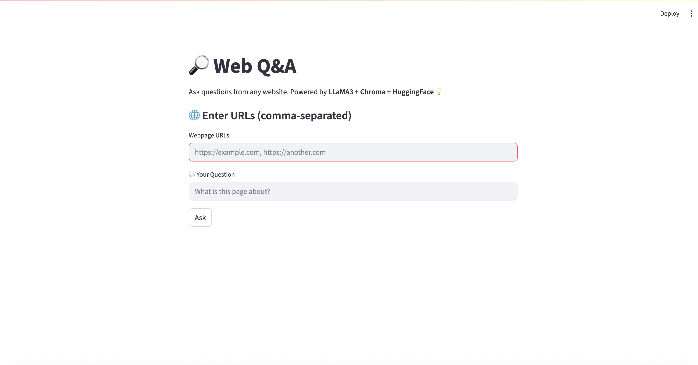
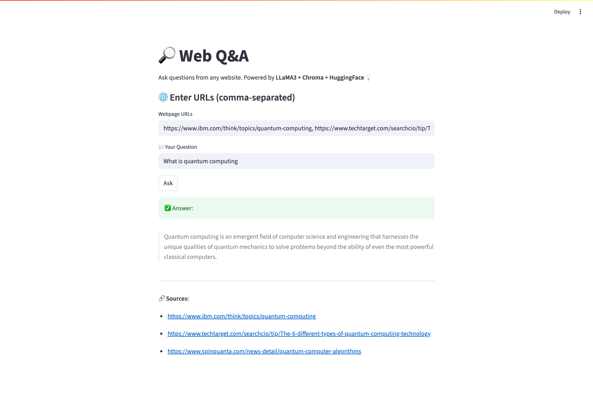

# 🔎 Web Q&A Assistant using Groq + LangChain + Streamlit

This project is a lightweight RAG (Retrieval-Augmented Generation) app that answers questions based on the content of any webpage you provide.

It uses:

- 🧠 **LLaMA3-70B** via [Groq API](https://console.groq.com/)
- 🧬 **HuggingFace Sentence Transformers** for embeddings
- 🗂️ **ChromaDB** for fast in-memory vector search
- 🌐 **LangChain** to orchestrate the RAG pipeline
- 🎨 **Streamlit** for a beautiful UI

---

## 🚀 Features

✅ Ask questions from **any website**  
✅ Fast, accurate answers via **Groq's LLaMA3-70B**  
✅ Clean UI with **Streamlit**  
✅ Fully open source & extendable

---

## 📸 Demo




---

## 🔧 Setup

### 1. Clone the Repo

```bash
git clone https://github.com/yourusername/rag-groq.git
cd rag-groq
```
